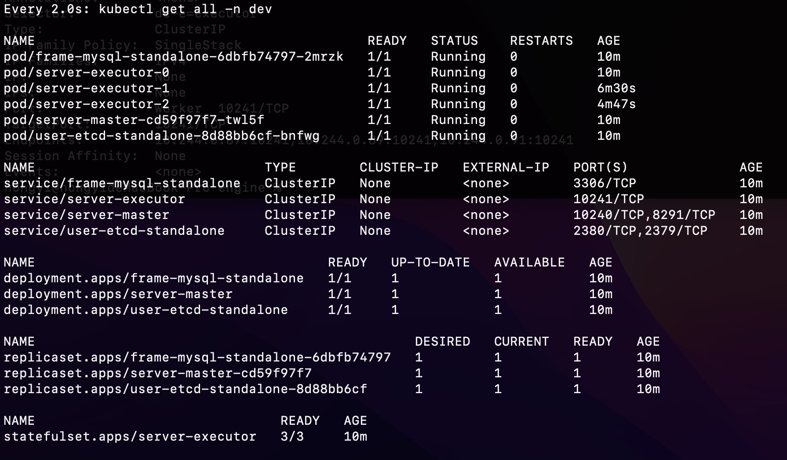

# dataflow-operator

- An operator demo of which dataflow engine running in kubernetes

---

# Introduction

## Notes

- The webhooks feature is not supported, will be implemented in the future

---

## Environment configuration

- go version not be higher than 1.18,now is 1.17.8. Currently, kubebuilder is not compatible with version 1.18
- kubernetes version is 1.23.0
- docker version is 20.10.14, docker desktop is 4.8.1
- kubebuilder version is 3.3.0
- kustomize version is 4.5.4

---

## USE

### Run the Controller locally

1. Install CRD in the kubernetes

```shell
    make manifests
    
    make install
```

2. Run controller

```shell
    make run
```

3. Test for user etcd standalone

- Test for user etcd standalone single

```shell
    kubectl apply -f config/samples/dataflow_v1_user_storage_with_single.yaml
```

```shell
    kubectl exec -it <pod_name> -n dev --  /bin/sh
    export ETCDCTL_API=3
    etcdctl member list
    // see --> started, dataflow-etcd, http://0.0.0.0:2380, http://0.0.0.0:2379
    // config success
```

- Test for user etcd standalone cluster

```shell
    kubectl apply -f config/samples/dataflow_v1_user_storage_with_cluster.yaml
```

- Connect to etcd server for test with different images

```shell
    // image:cnych/etcd:v3.4.13
    kubectl exec -it etcd-demo-0 -n dev --  /bin/sh 
    
    // input
   etcdctl --endpoints etcd-demo-0.etcd-demo:2379,etcd-demo-1.etcd-demo:2379,etcd-demo-2.etcd-demo:2379 endpoint status --write-out=table
   etcdctl member list
   
   // verify
    ping etcd-demo-1.etcd-demo:2379
    ping etcd-demo-2.etcd-demo:2379
```

```shell
    // image:quay.io/coreos/etcd
    kubectl exec -it etcd-demo-0 -n dev --  /bin/sh
    
    // input, need set etcd api version 
    export ETCDCTL_API=3
    etcdctl --endpoints etcd-demo-0.etcd-demo:2379,etcd-demo-1.etcd-demo:2379,etcd-demo-2.etcd-demo:2379 endpoint status --write-out=table
    etcdctl member list
    
    // verify
    ping etcd-demo-1.etcd-demo:2379
    ping etcd-demo-2.etcd-demo:2379
```

4. Test for frame mysql standalone

- Create CR for Single

```shell
    kubectl apply -f config/samples/dataflow_v1_single_frame_storage.yaml
```

- Connect to mysql server for test

```shell
    kubectl run -it --rm --image=mysql:5.7 --restart=Never mysql-client -n dev -- mysql -h frame-mysql-standalone -p123456
```

```shell
    // watch pods
    watch kubectl get all -l app=frame-mysql-standalone -n dev
    // watch service and deployment
    watch kubectl get all -l frame-mysql-standalone=mysql -n dev
```

- Create CR for Cluster

```shell
    kubectl apply -f config/samples/dataflow_v1_cluster_frame_storage.yaml
```

- Connect to mysql server for test

```shell
// write data
kubectl run mysql-client -n dev --image=mysql:5.7 -i --rm --restart=Never --\
  mysql -h mysql-0.mysql <<EOF
CREATE DATABASE test;
CREATE TABLE test.messages (message VARCHAR(250));
INSERT INTO test.messages VALUES ('hello');
EOF
```

```shell
// read data test1
kubectl run mysql-client -n dev --image=mysql:5.7 -i -t --rm --restart=Never --\
  mysql -h mysql -e "SELECT * FROM test.messages"
      
// read data test1
kubectl run mysql-client -n dev --image=mysql:5.7 -i -t --rm --restart=Never --\
  mysql -h mysql-read -e "SELECT * FROM test.messages"

```

5. Test for Dataflow Engine

- Test for 1m1e Demo

```shell
    kubectl apply -f config/samples/dataflow_v1_1m1e_demo.yaml
```

```shell
    watch kubectl get all -n dev
```

```shell
    kubectl describe pod <pod_name> -n dev
    kubectl logs <pod_name> -n dev
```

```shell
    kubectl delete -f config/samples/dataflow_v1_1m1e_demo.yaml
```

- Test for 1m3e Demo

```shell
    kubectl apply -f config/samples/dataflow_v1_1m3e_demo.yaml
```

```shell
    watch kubectl get all -n dev
```



```shell
    kubectl describe pod <pod_name> -n dev
    kubectl logs <pod_name> -n dev
```

```shell
    kubectl delete -f config/samples/dataflow_v1_1m3e_demo.yaml
```

6. Verify

```shell
    kubectl get pod -n dev
```

7. Delete CR

```shell
    kubectl delete -f xxx.yaml
```

8. Uninstall CRD

```shell
    make uninstall
```
